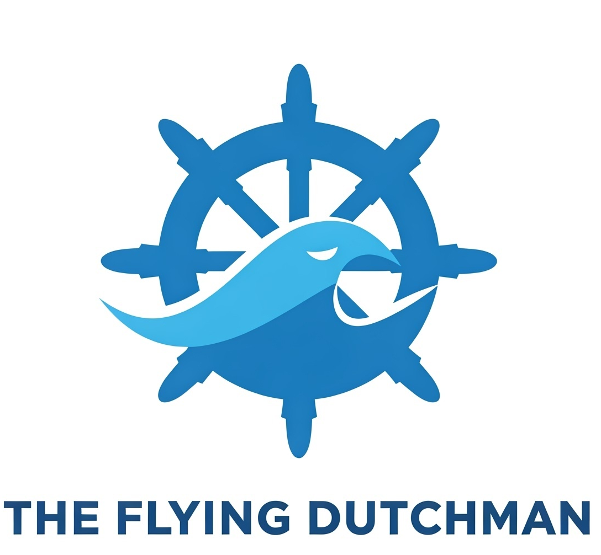
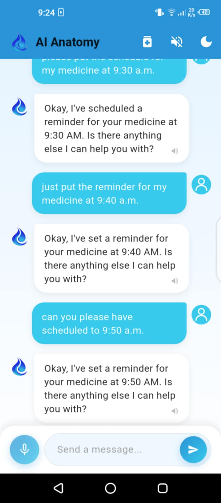

<div align="center">
  <h1>🧠 AI-Anatomy: The Flying Dutchman</h1>
  <p><em>AI-powered anatomy assistant for medical students and professionals</em></p>
  
  <br />
  <a href="https://github.com/chater-marzougui/AI-Anatomy/stargazers">
    
  </a>
  <a href="https://github.com/chater-marzougui/AI-Anatomy/network/members">
    
  </a>
  <a href="https://github.com/chater-marzougui/AI-Anatomy/issues">
    
  </a>
  <a href="https://github.com/chater-marzougui/AI-Anatomy/blob/main/LICENSE">
    
  </a>
  <a>

  [![LinkedIn][linkedin-shield]](https://www.linkedin.com/in/chater-marzougui-342125299/)
  </a> 

</div>

---

## 📱 Overview

**The Flying Dutchman** is a Flutter-based mobile application that uses the **Gemini AI API** to provide users with instant answers to medical questions, specifically in the domain of human anatomy. Whether you're revising for an exam, teaching a class, or just curious, this app brings intelligent anatomy assistance right to your pocket.

---

## 🚀 Features

- 💬 Ask complex Medical-related questions and get accurate AI-generated answers.
- 💬 Casual everyday chat and good advices.
- 🧠 Powered by **Google Gemini** for contextual medical understanding.
- 🌐 Real-time response via API (internet required).
- 📦 Lightweight and fast Flutter implementation.
- 🧪 Ideal for med students, educators, and healthcare pros.
- 💾 Offline cache for answered questions.
- 🗣️ Multi-language text-to-speech responses.
- 🌎 Multi-language support.
- 🌗 Dark mode/ Light mode toggle.

---

## 🛠 Installation

1. **Clone the repository**:
   ```bash
   git clone https://github.com/chater-marzougui/AI-Anatomy.git
   cd AI-Anatomy
   ```

2. **Install dependencies**:
   ```bash
   flutter pub get
   ```

3. **Set up your Gemini API Key**:
    - Add your API key to main.dart:
      ```
      GEMINI_API_KEY=your_key_here
      ```

4. **Run the app**:
   ```bash
   flutter run
   ```

---

## 🧪 Requirements

- Flutter SDK (>= 3.0.0)
- Android Studio / Xcode / VS Code
- Gemini API key from [Google AI Studio](https://makersuite.google.com/app)
- Internet connection

---

## 📸 Screenshots

<p align="center">
  
</p>

---

## 💡 Roadmap

- [x] Chat functionality
- [x] Text-to-speech support
- [x] Voice input support
- [x] Multi-language support
- [x] Dark mode/ Light mode toggle
- [x] Push notifications
- [ ] Personalized User Profiles: medical history, allergies, and medications.
- [ ] Symptom Checker: Identify conditions based on symptoms and provide initial guidance.
- [ ] Advanced Medication Reminders: e.g., every other day, skip weekends.
- [ ] Integration with Wearables: Allow users to receive notifications.
- [ ] Voice Command Support: Enable users to interact with the app using voice commands.

---

## 🤝 Contributing

Contributions are welcome! Open a PR or an issue and let's improve this app together.

---

## 📄 License

Distributed under the MIT License. See [`LICENSE`](LICENSE) for more info.

---

## ✨ Author

Made with 💙 by [Chater Marzougui](https://github.com/chater-marzougui)
- [@Chater-marzougui](linkedin-url) - chater.mrezgui2002@gmail.com <br/>


[linkedin-shield]: https://img.shields.io/badge/-LinkedIn-black.svg?style=for-the-badge&logo=linkedin&colorB=555